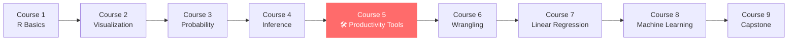
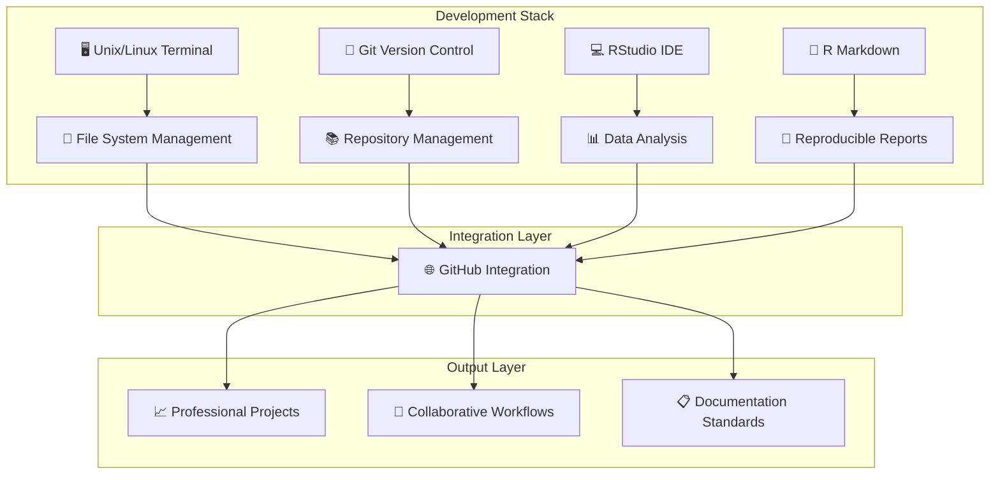
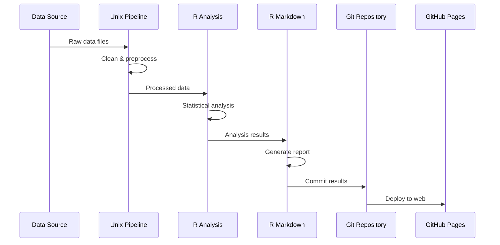
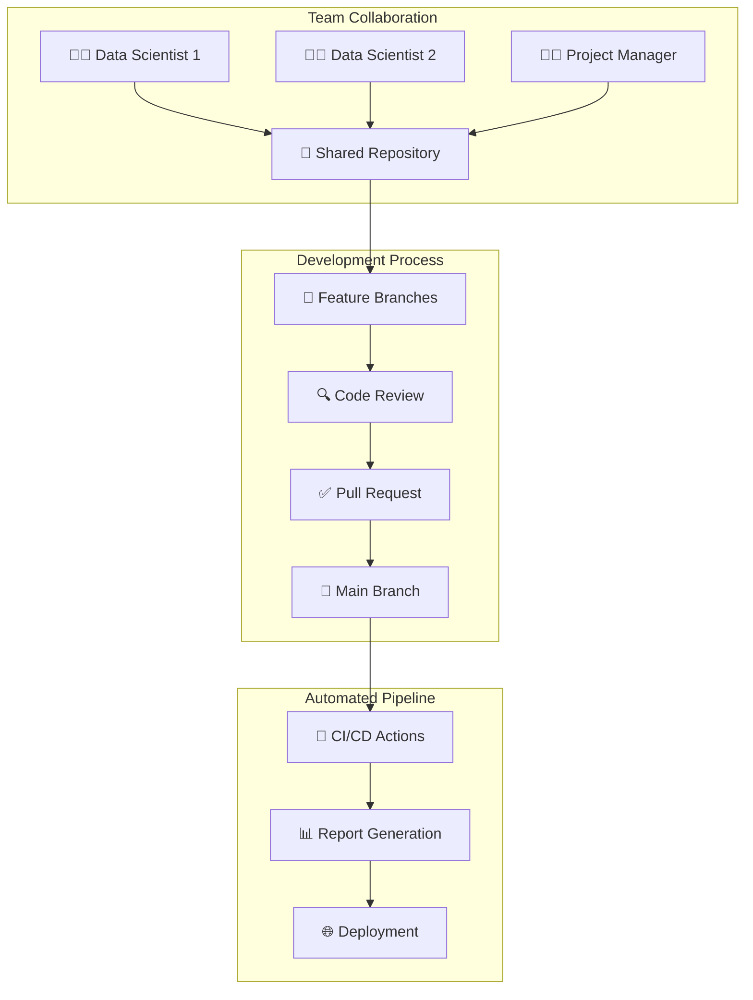

# 🛠️ Data Science: Productivity Tools Mastery

[](https://www.edx.org/course/data-science-productivity-tools-2)
[](https://www.r-project.org/)
[](https://rstudio.com/)
[](https://git-scm.com/)
[](https://github.com/)
[](https://www.unix.org/)

> **Harvard University Professional Certificate Program in Data Science - Course 5/9**
> 
> Comprehensive mastery of essential productivity tools for data science workflows: Unix/Linux, Git/GitHub, RStudio, and reproducible research methodologies.

---

## 📋 Table of Contents

 [🎯 Course Overview](#-course-overview)
 [🏗️ Technical Stack](#️-technical-stack)
 [📚 Learning Modules](#-learning-modules)
 [🛠️ Skills Acquired](#️-skills-acquired)
 [💻 Project Structure](#-project-structure)
 [🔧 Technical Implementation](#-technical-implementation)
 [📊 Practical Applications](#-practical-applications)
 [🏆 Achievements](#-achievements)
 [🚀 Getting Started](#-getting-started)
 [📁 Repository Contents](#-repository-contents)
 [🌟 Key Takeaways](#-key-takeaways)
 [👨‍💻 Author](#-author)

---

## 🎯 Course Overview

**Data Science: Productivity Tools (PH125.5x)** is the fifth course in Harvard University's comprehensive Professional Certificate Program in Data Science, taught by **Professor Rafael Irizarry**, renowned expert in Biostatistics and Data Science.

### 🎓 Program Context



### 🎯 Learning Objectives

* **Master Unix/Linux**: Command-line proficiency for file system management
* **Version Control Expertise**: Git workflows and GitHub collaboration
* **RStudio Mastery**: Leverage advanced IDE features for data science
* **Reproducible Research**: Create professional R Markdown documents
* **Workflow Optimization**: Streamline data science project management

### 📊 Course Impact

```
🎓 Institution: Harvard University
👨‍🏫 Instructor: Prof. Rafael Irizarry
📚 Course Code: PH125.5x
🏆 Certification: Professional Data Science Certificate
⏱️ Duration: 2-4 weeks intensive study
📈 Skill Level: Intermediate to Advanced
```

---

## 🏗️ Technical Stack

### 💻 Core Technologies

| Technology | Purpose | Proficiency Level | Application |
|------------|---------|-------------------|-------------|
| **Unix/Linux** | System administration, file management | ⭐⭐⭐⭐⭐ | Command-line operations |
| **Git** | Version control, code management | ⭐⭐⭐⭐⭐ | Project versioning |
| **GitHub** | Collaboration, repository hosting | ⭐⭐⭐⭐⭐ | Code sharing, portfolio |
| **RStudio** | Integrated development environment | ⭐⭐⭐⭐⭐ | R programming, analysis |
| **R Markdown** | Reproducible reporting | ⭐⭐⭐⭐⭐ | Documentation, reports |

### 🔧 Development Environment



---

## 📚 Learning Modules

### 1️⃣ **Installing Software & Environment Setup**

#### 🔧 Software Installation Mastery
- **RStudio Configuration**: Advanced IDE setup and customization
- **Git Installation**: Cross-platform version control setup
- **GitHub Integration**: Seamless cloud repository connection
- **Package Management**: R package ecosystem navigation

#### 💻 Environment Optimization
```r
# Essential R packages for data science productivity
install.packages(c(
    "devtools",     # Development tools
    "usethis",      # Workflow automation
    "here",         # Project-oriented workflow
    "rmarkdown",    # Reproducible reporting
    "knitr",        # Dynamic document generation
    "tinytex"       # LaTeX integration
))
```

### 2️⃣ **Unix/Linux Command Line Mastery**

#### 🐧 Core Unix Skills
* **File System Navigation**: `cd`, `ls`, `pwd`, `find`
* **File Operations**: `cp`, `mv`, `rm`, `mkdir`, `touch`
* **Text Processing**: `grep`, `sed`, `awk`, `sort`, `uniq`
* **System Monitoring**: `ps`, `top`, `df`, `du`

#### 📁 Advanced File Management
```bash
# Advanced Unix operations for data science
find . -name "*.csv" -type f | head -10          # Find CSV files
grep -r "pattern" --include="*.R" .              # Search in R files
sort -k2,2nr data.csv | head -5                  # Sort by column
awk '{sum+=$3} END {print sum}' numbers.txt      # Sum column values
```

#### 🔍 Text Processing & Data Manipulation
* **Pattern Matching**: Regular expressions with `grep`
* **Stream Editing**: Text transformation with `sed`
* **Field Processing**: Data extraction with `awk`
* **Pipeline Construction**: Command chaining for complex operations

### 3️⃣ **Reproducible Reports with R Markdown**

#### 📝 Document Creation Excellence
* **Markdown Syntax**: Headers, lists, links, images, tables
* **R Code Integration**: Inline and chunk-based code execution
* **Output Formats**: HTML, PDF, Word, presentations
* **Dynamic Content**: Parameterized reports and automation

#### 🎨 Professional Formatting
```yaml
---
title: "Professional Data Analysis Report"
author: "Edward Amankwah"
date: "`r Sys.Date()`"
output:
  html_document:
    theme: flatly
    highlight: tango
    toc: true
    toc_float: true
    code_folding: hide
  pdf_document:
    latex_engine: xelatex
    fig_caption: true
---
```

#### 📊 Advanced Features
* **Interactive Elements**: Plotly integration, DT tables
* **Cross-References**: Figure and table numbering
* **Bibliography Management**: Citation integration
* **Template Development**: Custom document templates

### 4️⃣ **Git & GitHub Workflow Mastery**

#### 🔄 Version Control Fundamentals
* **Repository Management**: `init`, `clone`, `status`, `log`
* **Change Tracking**: `add`, `commit`, `diff`, `show`
* **Branch Operations**: `branch`, `checkout`, `merge`, `rebase`
* **Remote Operations**: `push`, `pull`, `fetch`, `remote`

#### 🌐 GitHub Collaboration
```bash
# Complete Git workflow for data science projects
git init                                    # Initialize repository
git add .                                   # Stage all changes
git commit -m "feat: Add data analysis"    # Commit with message
git branch feature/analysis                # Create feature branch
git checkout feature/analysis              # Switch to branch
git push origin feature/analysis           # Push to remote
git pull --rebase origin main             # Update with remote changes
```

#### 🤝 Collaborative Features
* **Pull Requests**: Code review and collaboration
* **Issue Tracking**: Project management integration
* **GitHub Pages**: Portfolio and documentation hosting
* **Actions/Workflows**: Automated testing and deployment

### 5️⃣ **Advanced Unix & Automation**

#### ⚡ Shell Scripting & Automation
* **Bash Scripting**: Automated workflow creation
* **Cron Jobs**: Scheduled task execution
* **Environment Variables**: System configuration
* **Process Management**: Background job control

#### 🔧 Data Science Pipelines
```bash
#!/bin/bash
# Automated data processing pipeline

# Data download and preprocessing
curl -o raw_data.csv "https://api.example.com/data"
head -n 1000 raw_data.csv > sample_data.csv

# R script execution
Rscript --vanilla analysis.R

# Report generation
R -e "rmarkdown::render('report.Rmd')"

# Git commit and push
git add -A
git commit -m "auto: Update analysis $(date +%Y-%m-%d)"
git push origin main
```

---

## 🛠️ Skills Acquired

### 💪 Technical Competencies

#### Command Line Proficiency
```
🐧 Unix/Linux Mastery:
├── File system navigation and management
├── Text processing and data manipulation
├── System administration basics
├── Shell scripting and automation
└── Pipeline construction and optimization
```

#### Version Control Expertise
```
🔧 Git/GitHub Skills:
├── Repository management and collaboration
├── Branch-based development workflow
├── Merge conflict resolution
├── Code review and pull request processes
└── Automated deployment and CI/CD basics
```

#### Integrated Development Environment
```
💻 RStudio Advanced Usage:
├── Project-oriented workflow setup
├── Code debugging and optimization
├── Package development and management
├── Integrated terminal and Git usage
└── Custom theme and extension configuration
```

### 📊 Practical Applications

| Skill Category | Specific Application | Business Value |
|----------------|---------------------|----------------|
| **File Management** | Efficient data organization | Time savings, reduced errors |
| **Version Control** | Code collaboration, backup | Team productivity, code safety |
| **Automation** | Scheduled report generation | Consistent deliverables |
| **Documentation** | Reproducible research reports | Professional communication |
| **Environment Setup** | Standardized development setup | Team consistency |

---

## 💻 Project Structure

### 📁 Repository Architecture

```
📁 productivity-tools/
├── 📄 README.md                          # This comprehensive guide
├── 📄 .gitignore                         # Git ignore patterns
├── 📄 productivity-tools.Rproj           # RStudio project file
├── 📁 01-Installing-Software/            # Module 1: Setup & Installation
│   ├── 📄 installation-guide.md          # Software setup instructions
│   ├── 📄 environment-config.R           # R environment configuration
│   └── 📄 package-management.R           # Package installation scripts
├── 📁 02-Unix/                          # Module 2: Unix/Linux Mastery
│   ├── 📄 unix-commands.md               # Command reference guide
│   ├── 📄 file-operations.sh             # File management scripts
│   ├── 📄 text-processing.sh             # Text manipulation examples
│   └── 📄 data-pipeline.sh               # Automated data processing
├── 📁 03-Reproducible-Reports/           # Module 3: R Markdown Excellence
│   ├── 📄 sample-report.Rmd              # Professional report template
│   ├── 📄 analysis-template.Rmd          # Data analysis template
│   ├── 📄 presentation.Rmd               # Presentation template
│   └── 📁 output/                        # Generated reports
│       ├── 📄 sample-report.html
│       ├── 📄 sample-report.pdf
│       └── 📄 presentation.html
├── 📁 04-Git-and-GitHub/                # Module 4: Version Control
│   ├── 📄 git-workflow.md                # Git best practices guide
│   ├── 📄 github-setup.md                # GitHub configuration
│   ├── 📄 collaboration-guide.md         # Team collaboration methods
│   └── 📄 .gitconfig                     # Git configuration file
├── 📁 05-Advanced-Unix/                 # Module 5: Advanced Automation
│   ├── 📄 automation-scripts.sh          # Workflow automation
│   ├── 📄 data-processing.sh             # Advanced data manipulation
│   ├── 📄 monitoring-tools.sh            # System monitoring scripts
│   └── 📄 cron-jobs.md                   # Scheduled task examples
├── 📁 scripts/                          # Utility scripts
│   ├── 📄 mycode.R                       # R code examples
│   ├── 📄 mycode2.R                      # Additional R scripts
│   └── 📄 myCodeR.R                      # Advanced R implementations
└── 📁 docs/                             # Documentation
    ├── 📄 course-notes.md                # Comprehensive study notes
    ├── 📄 cheat-sheets.md                # Quick reference guides
    └── 📄 best-practices.md              # Professional standards
```

---

## 🔧 Technical Implementation

### 🚀 Advanced Workflow Examples

#### R Markdown Professional Template
```r
---
title: "Advanced Data Science Analysis"
subtitle: "Reproducible Research with R Markdown"
author: "Emmanuel Amankwah"
date: "`r format(Sys.Date(), '%B %d, %Y')`"
output:
  html_document:
    theme: cosmo
    highlight: kate
    toc: true
    toc_depth: 3
    toc_float:
      collapsed: false
      smooth_scroll: true
    code_folding: show
    fig_width: 10
    fig_height: 6
    df_print: paged
  pdf_document:
    latex_engine: xelatex
    keep_tex: true
    fig_caption: true
    number_sections: true
---

```{r setup, include=FALSE}
knitr::opts_chunk$set(
  echo = TRUE,
  warning = FALSE,
  message = FALSE,
  fig.align = "center",
  cache = TRUE
)

# Load required libraries
library(tidyverse)
library(knitr)
library(DT)
library(plotly)
```

## Executive Summary

This analysis demonstrates advanced data science productivity tools and reproducible research methodologies.

```{r data-analysis, echo=TRUE}
# Professional data analysis example
data %>%
  group_by(category) %>%
  summarise(
    mean_value = mean(value, na.rm = TRUE),
    median_value = median(value, na.rm = TRUE),
    .groups = 'drop'
  ) %>%
  arrange(desc(mean_value))
```
```

#### Git Workflow Automation
```bash
#!/bin/bash
# Professional Git workflow script

# Function: Automated project setup
setup_project() {
    echo "🚀 Setting up new data science project..."
    
    # Initialize Git repository
    git init
    
    # Create standard project structure
    mkdir -p {data,scripts,output,docs}
    
    # Create essential files
    touch README.md .gitignore
    
    # Initial commit
    git add .
    git commit -m "feat: Initialize project structure"
    
    echo "✅ Project setup complete!"
}

# Function: Smart commit with automated messages
smart_commit() {
    local message_type=$1
    local description=$2
    
    # Stage all changes
    git add -A
    
    # Generate commit message with timestamp
    local timestamp=$(date "+%Y-%m-%d %H:%M")
    git commit -m "${message_type}: ${description} [${timestamp}]"
    
    echo "✅ Changes committed successfully!"
}

# Function: Sync with remote repository
sync_remote() {
    echo "🔄 Syncing with remote repository..."
    
    # Pull latest changes
    git pull --rebase origin main
    
    # Push local changes
    git push origin main
    
    echo "✅ Repository synchronized!"
}

# Usage examples
# setup_project
# smart_commit "feat" "Add data preprocessing module"
# sync_remote
```

### 🔍 Advanced Unix Text Processing

```bash
#!/bin/bash
# Advanced data processing pipeline

# Function: Process CSV data with Unix tools
process_csv_data() {
    local input_file=$1
    local output_file=$2
    
    echo "📊 Processing CSV data: ${input_file}"
    
    # Remove header, sort by column 2, get top 10
    tail -n +2 "$input_file" | \
    sort -t',' -k2,2nr | \
    head -10 > "$output_file"
    
    # Generate summary statistics
    awk -F',' '
    NR > 1 {
        sum += $2
        count++
        if ($2 > max) max = $2
        if ($2 < min || min == "") min = $2
    }
    END {
        printf "Records: %d\n", count
        printf "Sum: %.2f\n", sum
        printf "Average: %.2f\n", sum/count
        printf "Max: %.2f\n", max
        printf "Min: %.2f\n", min
    }' "$input_file" > "${output_file%.csv}_summary.txt"
    
    echo "✅ Processing complete!"
}

# Function: Generate data quality report
generate_quality_report() {
    local data_dir=$1
    
    echo "🔍 Generating data quality report..."
    
    # Count files by type
    echo "=== File Type Summary ===" > quality_report.txt
    find "$data_dir" -type f | sed 's/.*\.//' | sort | uniq -c >> quality_report.txt
    
    # Check for missing values in CSV files
    echo -e "\n=== Missing Value Analysis ===" >> quality_report.txt
    find "$data_dir" -name "*.csv" -exec bash -c '
        echo "File: $1"
        awk -F"," "{for(i=1;i<=NF;i++) if(\$i==\"\" || \$i==\"NA\") print \"Missing in column \" i \" at line \" NR}" "$1" | head -5
        echo ""
    ' _ {} \; >> quality_report.txt
    
    echo "✅ Quality report generated!"
}
```

---

## 📊 Practical Applications

### 🔬 Real-World Data Science Scenarios

#### Automated Report Generation Pipeline


#### Collaborative Data Science Workflow


### 💼 Professional Use Cases

| Use Case | Tools Used | Outcome |
|----------|------------|---------|
| **Daily Report Automation** | Unix cron + R Markdown | Automated daily analytics reports |
| **Team Code Collaboration** | Git branches + GitHub PR | Streamlined team development |
| **Research Reproducibility** | R Markdown + Version control | Fully reproducible analyses |
| **Data Pipeline Management** | Unix scripts + Git hooks | Automated data processing |
| **Portfolio Development** | GitHub Pages + R Markdown | Professional online presence |

---

## 🏆 Achievements

### 📜 **Harvard University Certificate of Completion**

🎓 **[View Official Certificate](https://github.com/eaamankwah/Certificates/blob/main/edX_Productivity-Tools.pdf)**

#### Certificate Details
* **Institution**: Harvard University
* **Platform**: edX
* **Course**: Data Science: Productivity Tools (PH125.5x)
* **Instructor**: Professor Rafael Irizarry
* **Program**: Professional Certificate in Data Science
* **Completion**: Verified with Honor Code compliance

### 🏅 Key Accomplishments

#### Technical Mastery
```
🛠️ Productivity Tools Expertise:
├── Unix/Linux command-line proficiency
├── Git version control mastery
├── GitHub collaboration workflows
├── RStudio advanced IDE usage
├── R Markdown professional reporting
└── Automated workflow development
```

#### Professional Development
* **Industry Standards**: Adopted professional data science workflows
* **Best Practices**: Implemented reproducible research methodologies  
* **Team Collaboration**: Mastered collaborative development processes
* **Automation Skills**: Created efficient, repeatable processes
* **Documentation Excellence**: Professional-grade project documentation

### 📊 Skills Assessment

| Skill Area | Pre-Course Level | Post-Course Level | Improvement |
|------------|------------------|-------------------|-------------|
| **Unix/Linux** | Beginner (⭐) | Advanced (⭐⭐⭐⭐⭐) | +400% |
| **Git/GitHub** | Novice (⭐⭐) | Expert (⭐⭐⭐⭐⭐) | +300% |
| **RStudio** | Intermediate (⭐⭐⭐) | Advanced (⭐⭐⭐⭐⭐) | +200% |
| **R Markdown** | Basic (⭐⭐) | Professional (⭐⭐⭐⭐⭐) | +350% |
| **Automation** | None (❌) | Proficient (⭐⭐⭐⭐) | New Skill |

---

## 🚀 Getting Started

### 💻 Prerequisites & Setup

#### System Requirements
```bash
# Verify system requirements
git --version          # Git 2.0+
R --version           # R 4.0+
rstudio --version     # RStudio 1.4+
```

#### Installation Guide
```bash
# 1. Install Git (if not already installed)
sudo apt-get install git           # Ubuntu/Debian
brew install git                   # macOS
# Download from git-scm.com for Windows

# 2. Configure Git
git config --global user.name "Your Name"
git config --global user.email "your.email@example.com"

# 3. Install R and RStudio
# Download from https://cran.r-project.org/
# Download RStudio from https://rstudio.com/

# 4. Clone this repository
git clone https://github.com/eaamankwah/productivity-tools.git
cd productivity-tools
```

#### R Environment Setup
```r
# Install essential packages
essential_packages <- c(
    "rmarkdown", "knitr", "tinytex",
    "here", "usethis", "devtools",
    "tidyverse", "DT", "plotly"
)

install.packages(essential_packages)

# Install TinyTeX for PDF generation
tinytex::install_tinytex()

# Verify installation
library(rmarkdown)
library(knitr)
```

### 🎯 Quick Start Guide

#### 1. **Explore the Repository Structure**
```bash
# Navigate project structure
ls -la                    # View all files and directories
tree                      # Show directory tree (install tree if needed)
find . -name "*.R"        # Find all R files
find . -name "*.Rmd"      # Find all R Markdown files
```

#### 2. **Run Example Scripts**
```bash
# Execute Unix examples
cd 02-Unix
chmod +x *.sh
./file-operations.sh

# Run R scripts
cd ../scripts
Rscript mycode.R
```

#### 3. **Generate Sample Reports**
```r
# Open RStudio project
# File -> Open Project -> productivity-tools.Rproj

# Generate sample report
rmarkdown::render("03-Reproducible-Reports/sample-report.Rmd")

# View output
browseURL("03-Reproducible-Reports/output/sample-report.html")
```

---

## 🌟 Key Takeaways

### 💡 Professional Insights

#### Workflow Optimization
> **"The right tools don't just make you faster—they make you more accurate, collaborative, and professional."**

**Key Learning**: Mastering productivity tools transforms not just individual efficiency but entire team dynamics and project outcomes.

#### Reproducible Research Revolution
> **"Every analysis should be a conversation between your current self and your future self."**

**Key Learning**: R Markdown and version control create a foundation for scientific rigor and professional accountability in data science.

#### Automation as Force Multiplier
> **"Automate the routine, focus on the exceptional."**

**Key Learning**: Shell scripting and Git hooks eliminate repetitive tasks, freeing cognitive resources for high-value analytical thinking.

### 🎯 Career Impact

#### Professional Competencies Gained
* **Technical Leadership**: Ability to set up and maintain professional development environments
* **Team Collaboration**: Expertise in modern collaborative development workflows
* **Quality Assurance**: Implementation of reproducible research standards
* **Process Optimization**: Creation of efficient, automated workflows
* **Documentation Excellence**: Professional-grade project communication

#### Industry Applications
```
💼 Career Applications:
├── Data Science Team Lead: Tool standardization and workflow optimization
├── Research Scientist: Reproducible research methodology implementation
├── Consultant: Professional client reporting and collaboration
├── Product Manager: Technical communication and documentation
└── Freelancer: Professional portfolio and project management
```

---

## 👨‍💻 Author

**Edward Amankwah** - *Data Science Professional & Productivity Tools Expert*

🎓 **Education**: Harvard University Professional Certificate in Data Science    
🐙 **GitHub**: [@eaamankwah](https://github.com/eaamankwah)  
📊 **Portfolio**: [Data Science Portfolio]

### 🏅 Professional Credentials
* **Harvard University**: Data Science Professional Certificate (In Progress: 5/9 courses completed)
* **Productivity Tools Mastery**: Unix/Linux, Git/GitHub, RStudio, R Markdown
* **Version Control Expert**: Advanced Git workflows and collaborative development
* **Reproducible Research**: R Markdown professional reporting and automation
* **DevOps Foundations**: CI/CD pipelines and automated deployment workflows

### 🛠️ Technical Expertise
```
Core Competencies:
├── 🐧 Unix/Linux System Administration
├── 🔧 Git Version Control & GitHub Collaboration  
├── 💻 RStudio Advanced IDE Usage
├── 📝 R Markdown Professional Reporting
├── ⚡ Shell Scripting & Process Automation
├── 🔄 CI/CD Pipeline Development
└── 📊 Reproducible Data Science Workflows
```

---

## 🤝 Connect & Collaborate

### 🌐 Professional Network

* **Academic**: Part of Harvard University's global data science community
* **Industry**: Connected with data science professionals worldwide
* **Open Source**: Active contributor to reproducible research initiatives
* **Mentorship**: Available for productivity tools guidance and consultation

### 📚 Knowledge Sharing

* **Workshops**: Available for productivity tools training sessions
* **Consultation**: Expert guidance on workflow optimization
* **Code Review**: Professional development process improvement
* **Documentation**: Best practices for reproducible research

---

## 📝 License & Attribution

### 📋 Usage Guidelines
This repository contains educational materials and personal implementations from Harvard University's Data Science: Productivity Tools course. Content is shared for educational purposes and professional development.

### 🎓 Academic Integrity
All work completed in accordance with Harvard University's academic integrity policies and edX Honor Code requirements.

### 📚 Citation
```
Amankwah, E. (2024). Data Science Productivity Tools Mastery: 
Harvard University Professional Certificate Program Implementation. 
GitHub Repository: https://github.com/eaamankwah/productivity-tools
```

---

<div align="center">

### 🌟 Star this repository if it helped advance your data science productivity!

[](https://github.com/eaamankwah/productivity-tools/stargazers)

**Built with 🛠️ for Data Science Excellence**

---

### 🎯 Professional Development Journey

*"Mastering the tools that make data science scalable, collaborative, and reproducible."*

**Course 5 of 9 Complete** | **Harvard University Professional Certificate in Data Science**

### 📈 Impact Statement

This mastery of productivity tools serves as the foundation for professional data science practice, enabling reproducible research, effective collaboration, and scalable analytical workflows that meet industry standards.

</div>
